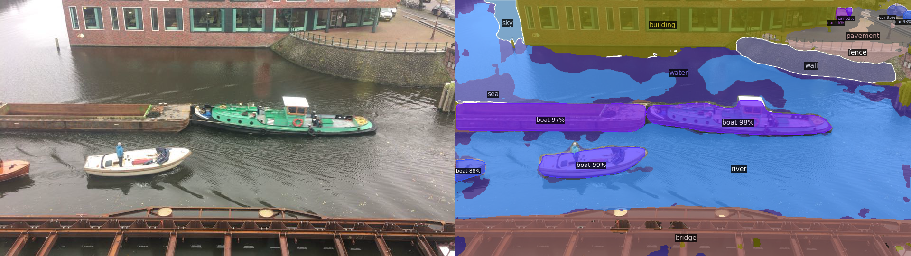

# Boat Detector Amsterdam

Hobby project to detect boats on the canals in Amsterdam.

Detector2 demo.

### Data

I set up an old iPhone as a webcam and monitored this stream. In the initial phase I captured a picture every 10 seconds, to not take too many space in my HDD, and then manually filtered all the images that had any boats in it to do some tests for motion detection. Later, pictures are taken every second when there were moving objects in the picture to gather data. This could then be used to determine how many boats passed by over a certain time period.

### Further 

- Determine what kind of boat is passing by (longboat, cargo, canoe, sup?).
